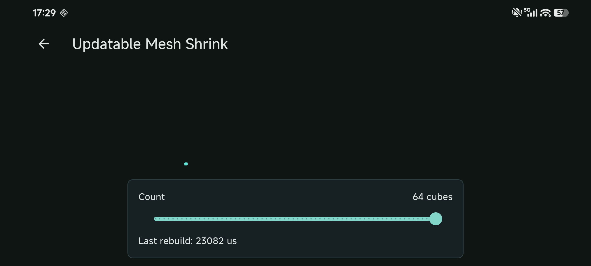
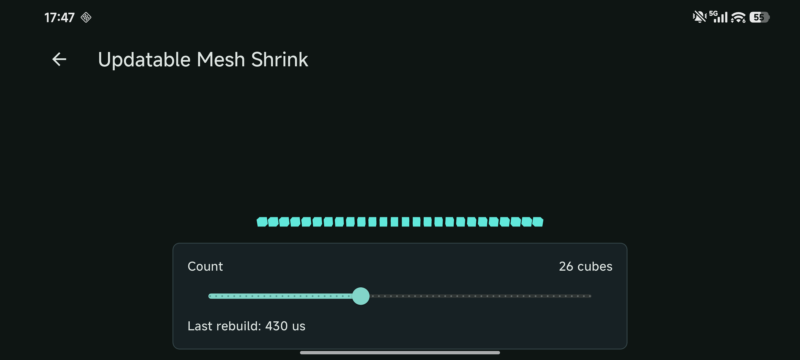

# Updatable Mesh Shrink

This case reproduces an out-of-bounds GPU upload when an updatable
`MeshGeometry` shrinks and then regrows. The minimal sequence is an array of
cube geometry changing from `64 -> 1 -> 64` cubes.

## Run

From the repository root, fetch the version pinned by the checked-out state:

```text
fvm flutter pub get
```

Use the catalog entry for a manual interaction check:

```text
fvm flutter run --enable-flutter-gpu --enable-impeller
```

Run the focused device regression with:

```text
fvm flutter drive --driver=test_driver/integration_test.dart --target=integration_test/updatable_mesh_shrink_test.dart -d <device-id> --enable-flutter-gpu --enable-impeller
```

## Historical States

The immutable tags run the same integration test against different engine
revisions. Check out the selected tag before resolving dependencies.

| Tag | Engine revision | Expected result |
| --- | --- | --- |
| `repro/updatable-mesh-shrink-before` | upstream `7ec6e96` | `RangeError` during the shrink step |
| `repro/updatable-mesh-shrink-fixed` | fork `a172305` | Test passes |

The current `main` is pinned to the fixed fork revision `a172305` and its
matching `scene` package. The before tag is intentionally a failing regression:
its `evidence/before-range-error.txt` records the expected `RangeError`.

## Evidence

The screenshots are supporting interaction-state evidence, not a pixel-for-
pixel visual comparison. The behavioral verdict comes from the failure log and
focused device regression.

| Upstream baseline | Fixed local engine |
| --- | --- |
| <a href="evidence/android-before-range-error-ui.png"></a><br>UI sample from the failing baseline. | <a href="evidence/android-fixed-live-update-ui.png"></a><br>Post-fix interaction sample at 26 cubes. |

[`evidence/README.md`](evidence/README.md) records hashes and what each file
does and does not prove.
